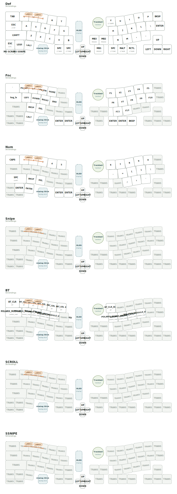

# GeaconPolaris

**GeaconPolaris is not merely a keyboard firmware repository.**

It is a ZMK-powered split ergonomic input device, built around the idea that typing, pointing, scrolling, navigating, and experimenting with input hardware should live in the same constellation.

Polaris is the North Star of the Geacon lineage: a route marker for modular input, a working keyboard, and a platform for trying trackballs, touchpads, rotary encoders, joystick-style controls, and sensor-driven interaction without treating them as afterthoughts.



## Concept

GeaconPolaris is a split ergonomic keyboard configuration for [ZMK Firmware](https://zmk.dev/), targeting `seeeduino_xiao_ble`.

The design is centered on a simple premise: a keyboard can be more than a grid of switches. It can be a navigation instrument. The current firmware keeps that route explicit through base shields, module Snippets, a shared physical layout, and a keymap that treats pointing and scrolling as first-class operations.

This repository is therefore both:

- a usable ZMK user config for building Polaris firmware;
- a record of an input-device experiment at the edge of keyboard, pointer, and controller.

## Features

- **Split ergonomic ZMK configuration** for `seeeduino_xiao_ble`.
- **Base shield pair** under `boards/shields/GeaconPolaris/`: `Polaris_L_Base` and `Polaris_R_Base`.
- **Runtime module selection** through `zmk-input-module`, `snippets/ModuleMux`, and per-half settings.
- **Centralized pin definitions** in `boards/shields/GeaconPolaris/Polaris_pins.dtsi`.
- **Shared physical layout definition** in `boards/shields/GeaconPolaris/Polaris.dtsi`, including `zmk,physical-layout` and custom module layout nodes.
- **Left-side OLED** via `Polaris_L_Base.overlay` and `nice_oled` in the left build targets.
- **LED aliases and GPIO LEDs** defined in `Polaris.dtsi`.
- **Seven ZMK layers** defined in `config/Polaris.keymap`: `DEF`, `FUNC`, `NUM`, `SNIPE`, `BT`, `SCROLL`, and `SSNIPE`.
- **Combos** for language switching: `COMBO_LANG1` and `COMBO_LANG2`.
- **Runtime sensor rotate behaviors** for scrolling and volume-style sensor bindings.
- **layout-shift key press behavior** via `layout_shift.dtsi` and `zmk,behavior-layout-shift-key-press`.
- **Generated visual previews**:
  - `keymap-svg/Polaris.svg`: physical-layout-based keymap SVG with combo overlays.
  - `keymap-drawer/Polaris.svg`: keymap-drawer output.
- **Custom GitHub Actions builds** that compose a matrix from `build.yaml`, cache west/ccache, upload successful firmware artifacts, and optionally commit firmware files back to `firmware/<safe-branch-name>/`.

## Modular Input System

Polaris is designed as a modular input platform, not just as a typing board.

The current firmware path uses a single firmware image per half. Module hardware is selected by the user through a keymap behavior, saved in Zephyr settings, and restored on the next boot. This is implemented by the standalone `zmk-input-module` module plus the Polaris-specific `ModuleMux` snippet.

The base shields stay stable. The candidate devices for each module are compiled into the unified firmware as deferred devices, and only the selected profile is initialized after settings are loaded.

### Left-Hand Modules

| Profile | Hardware path | Notes |
| --- | --- | --- |
| `POLARIS_MODULE_ENC` | EC11 encoder | Left-side rotary encoder candidate. |
| `POLARIS_MODULE_JOY` | Analog input + EC11 encoder | Left-side joystick candidate with encoder route. |
| `POLARIS_MODULE_TB` | `spi2` + PMW3610 | Left-side trackball candidate. |
| `POLARIS_MODULE_TPD` | hardware `i2c0` + Cirque Pinnacle | Left-side touchpad candidate. |

### Right-Hand Modules

| Profile | Hardware path | Notes |
| --- | --- | --- |
| `POLARIS_MODULE_TB` | `spi2` + PMW3610 | Right-side trackball candidate. |
| `POLARIS_MODULE_TPD` | hardware `i2c0` + Cirque Pinnacle | Right-side touchpad candidate. |
| `POLARIS_MODULE_IQS` | hardware `i2c1` + IQS9151 | Right-side IQS candidate. IQS is exclusive on Polaris, not an optional companion module. Polaris IQS pins are SDA=D4/P0.04, SCL=D8/P1.13, DR=D7/P1.12. |

Left and right profiles are stored separately on each MCU. Select the desired module profile from the physical half that owns the module, then reboot that half for the selected deferred device path to be initialized.

`POLARIS_MODULE_UNSPECIFIED` intentionally initializes no module candidate. It is useful as a safe state when changing hardware.

Per-module Snippets were removed from the normal source tree. `build.yaml` now uses only the unified ModuleMux route:

- `Polaris_L_UNIFIED`: `Polaris_L_Base rgbled_adapter nice_oled` with `Central ModuleMux`
- `Polaris_R_UNIFIED`: `Polaris_R_Base rgbled_adapter` with `Peripheral ModuleMux`

TODO: Document the physical attachment mechanism and whether modules are hot-swappable at the hardware level.

## Keymap

The keymap lives in [`config/Polaris.keymap`](config/Polaris.keymap).

Layer constants are defined as:

| Constant | Value | Layer node | Label |
| --- | ---: | --- | --- |
| `DEF` | `0` | `default_layer` | `Def` |
| `FUNC` | `1` | `function_layer` | `Fnc` |
| `NUM` | `2` | `num_layer` | `Num` |
| `SNIPE` | `3` | `snipe_layer` | `Snipe` |
| `BT` | `4` | `bt_layer` | `BT` |
| `SCROLL` | `5` | `scroll_layer` | `SCROLL` |
| `SSNIPE` | `6` | `SSNIPE_layer` | `SSNIPE` |

### Layer Notes

- **`DEF` / `default_layer`**: the main typing layer. It includes layer-tap access to `BT`, `NUM`, `FUNC`, and `SNIPE`, mouse buttons on the right-hand side, and momentary access to `SCROLL` / `SSNIPE`.
- **`FUNC` / `function_layer`**: navigation, function keys, and layout-shift toggle via `&tog_ls`.
- **`NUM` / `num_layer`**: number row, symbols, enter/backspace/delete, and navigation keys.
- **`SNIPE` / `snipe_layer`**: a precision-oriented layer with mostly transparent bindings and navigation controls.
- **`BT` / `bt_layer`**: Bluetooth clear/select bindings, plus module profile selection keys. The left half exposes `ENC`, `JOY`, `TB`, `TPD`, and `UNSPECIFIED`; the right half exposes `TB`, `TPD`, `IQS`, and `UNSPECIFIED`.
- **`SCROLL` / `scroll_layer`**: scroll-oriented layer using sensor bindings.
- **`SSNIPE` / `SSNIPE_layer`**: a second precision/scroll-related layer using the same sensor-binding style.

### Combos

Two combos are currently defined:

| Combo | Binding | Key positions |
| --- | --- | --- |
| `COMBO_LANG1` | `&kp LANGUAGE_1` | `<1 2>` |
| `COMBO_LANG2` | `&kp LANG2` | `<2 3>` |

The physical-layout SVG preview draws these combos as overlays connecting their `key-positions`, so the keymap is visible as geometry, not just text.

### Behaviors and Sensors

`config/Polaris.keymap` defines and uses several non-trivial behaviors:

- `original_key_press`: keeps the original `zmk,behavior-key-press` available.
- `kp`: overrides key press through `zmk,behavior-layout-shift-key-press`.
- `rsr_msch`: runtime sensor rotate behavior for vertical scroll bindings.
- `rsr_mscv`: runtime sensor rotate behavior for horizontal scroll bindings.
- `rsr_vol`: runtime sensor rotate behavior for volume-style bindings.

TODO: Explain the intended user-facing behavior of `layout_shift.dtsi` in more detail.

## Build

Firmware builds are defined by [`build.yaml`](build.yaml) and executed by [`.github/workflows/build.yml`](.github/workflows/build.yml).

This repository uses the reusable firmware workflow from `te9no/zmk-workspace`.

The workflow:

- reads `build.yaml`;
- filters targets by the optional `workflow_dispatch` `target` regex;
- prepares a west workspace before matrix builds;
- restores west module caches;
- restores and saves ccache;
- builds matrix entries with `max_parallel: 4`;
- uploads each successful firmware as an artifact;
- optionally commits firmware files back to `firmware/<safe-branch-name>/`;
- runs a daily scheduled build health check and opens/updates an issue when the scheduled build fails.

It runs on:

- manual `workflow_dispatch`;
- pushes that change `config/**`, `boards/**`, `snippets/**`, `build.yaml`, `zephyr/module.yml`, or the build workflow/scripts.

The `target` workflow input is matched against artifact name, board, shield, and snippet. Use `all` to build every target.

### Build Matrix

| Artifact | Board | Shields | Snippet |
| --- | --- | --- | --- |
| `Polaris_L_UNIFIED` | `seeeduino_xiao_ble` | `Polaris_L_Base rgbled_adapter nice_oled` | `Central ModuleMux zmk-usb-logging studio-rpc-usb-uart` |
| `Polaris_R_UNIFIED` | `seeeduino_xiao_ble` | `Polaris_R_Base rgbled_adapter` | `Peripheral ModuleMux zmk-usb-logging studio-rpc-usb-uart` |
| settings reset | `seeeduino_xiao_ble` | `settings_reset` | none |

### Local Build Example

Use the same board, shield, and snippet combinations as `build.yaml`.

Example: left unified firmware.

```sh
west build \
  -s zmk/app \
  -b seeeduino_xiao_ble \
  -S "Central ModuleMux zmk-usb-logging studio-rpc-usb-uart" \
  -- \
  -DSHIELD="Polaris_L_Base rgbled_adapter nice_oled" \
  -DZMK_CONFIG=/path/to/zmk-config-GeaconPolaris/config \
  -DZMK_EXTRA_MODULES=/path/to/zmk-config-GeaconPolaris
```

Example: right unified firmware.

```sh
west build \
  -s zmk/app \
  -b seeeduino_xiao_ble \
  -S "Peripheral ModuleMux zmk-usb-logging studio-rpc-usb-uart" \
  -- \
  -DSHIELD="Polaris_R_Base rgbled_adapter" \
  -DZMK_CONFIG=/path/to/zmk-config-GeaconPolaris/config \
  -DZMK_EXTRA_MODULES=/path/to/zmk-config-GeaconPolaris
```

TODO: Document the exact local west setup expected for this repository, including module dependencies from `config/west.yml`.

## Keymap SVG Workflow

The keymap SVG is generated by [`.github/workflows/draw-keymap.yml`](.github/workflows/draw-keymap.yml).

This workflow calls a reusable workflow from `te9no/zmk-workspace`:

```yaml
jobs:
  draw-keymap-svg:
    uses: te9no/zmk-workspace/.github/workflows/draw-keymap-svg.yml@main
    permissions:
      contents: write
    with:
      commit_message: "[Draw keymap-svg] ${{ github.event.head_commit.message || 'manual run' }}"
      amend_commit: false
      keymap_patterns: "config/*.keymap"
      output_folder: "keymap-svg"
      destination: "both"
      artifact_name: "keymap-svg"
```

It runs on:

- manual `workflow_dispatch`;
- pushes that change keymap, layout, JSON, keymap-drawer config, or the workflow file.

The output is written to [`keymap-svg/Polaris.svg`](keymap-svg/Polaris.svg) and uploaded as an artifact.

## Repository Structure

| Path | Purpose |
| --- | --- |
| `config/Polaris.keymap` | ZMK keymap, layers, combos, and behavior definitions. |
| `config/Polaris.json` | Layout JSON used by drawing tools. |
| `config/west.yml` | West manifest for ZMK/modules used by this config. |
| `boards/shields/GeaconPolaris/Polaris.dtsi` | Shared physical layout, matrix transform, custom module layout nodes, aliases, LEDs, sensors, and battery node. |
| `boards/shields/GeaconPolaris/Polaris_pins.dtsi` | Centralized pin assignment table. |
| `boards/shields/GeaconPolaris/Polaris_L_Base.overlay` | Left-hand base shield overlay, including kscan and OLED/I2C setup. |
| `boards/shields/GeaconPolaris/Polaris_R_Base.overlay` | Right-hand base shield overlay and transform offset. |
| `boards/shields/GeaconPolaris/Polaris_L_Base.conf` | Left-hand base Kconfig. |
| `boards/shields/GeaconPolaris/Polaris_R_Base.conf` | Right-hand base Kconfig. |
| `snippets/Central/` | Central-half role snippet for unified firmware. |
| `snippets/Peripheral/` | Peripheral-half role snippet for unified firmware and right-side IQS Kconfig. |
| `snippets/ModuleMux/` | Unified module candidate graph for `ENC`, `JOY`, `TB`, `TPD`, and right-side `IQS`. |
| `include/dt-bindings/polaris/module_select.h` | Polaris-specific module profile IDs. |
| `docs/module-mux.md` | ModuleMux profile, deferred-init strategy, and remaining hardware checks. |
| `docs/boot-diagnostics.md` | Boot failure diagnostic record, root cause summary, cleanup notes, and remaining checks. |
| `CMakeLists.txt`, `Kconfig`, `zephyr/module.yml` | Minimal Zephyr module metadata so local headers, DTS bindings, boards, and snippets are discoverable. |
| `build.yaml` | ZMK build matrix. |
| `.github/workflows/build.yml` | Firmware build, artifact upload, and firmware publish workflow. |
| `.github/workflows/draw-keymap.yml` | Physical-layout keymap SVG workflow. |
| `keymap-svg/Polaris.svg` | Generated physical-layout SVG preview. |
| `keymap-drawer/` | keymap-drawer config and output. |
| `firmware/` | Firmware files committed by the build workflow when enabled. |

## Notes / Philosophy

Polaris is named like a direction, not a product SKU.

A normal keyboard config answers: which key sends which code? GeaconPolaris asks a broader question: how many forms of input can a split ergonomic device hold before it stops being a keyboard and becomes a navigation surface?

The answer here is intentionally practical. The idea is not hidden in prose; it is expressed as base shields, module Snippets, build artifacts, keymap layers, combos, centralized pin definitions, and generated SVGs. The myth is allowed only because the implementation is there to carry it.

This is the Geacon lineage pointing north: toward a keyboard that can type, point, scroll, switch modes, and still be built from inspectable ZMK configuration.

## TODO

- Document hardware photos, assembly notes, and module installation procedure.
- Clarify whether the modules are electrically hot-swappable or simply build-time/module variants.
- Expand `layout_shift.dtsi` explanation with examples.
- Document each pointing module's runtime behavior from the user's perspective.
- Add flashing instructions for each generated artifact.
- Confirm power configuration and battery expectations in hardware terms.
- Add screenshots or rendered images for each module variant if available.

## Fact-Check Notes

The following points should be verified against hardware documentation or the author's notes before being presented as final claims:

- Physical attachment and swapping mechanism for the modules.
- Exact sensor hardware used by the `IQS` Snippet.
- Battery type, runtime, and charging/power path assumptions.
- Whether `nice_oled` is present for all left-hand builds or only specific hardware assemblies.
- Exact intended user semantics of `SNIPE`, `SCROLL`, and `SSNIPE` beyond their current keymap bindings.
- Meaning and expected workflow for `layout_shift.dtsi`.

## License

See [`LICENCE`](LICENCE) for license details.

---

# GeaconPolaris 日本語版

**GeaconPolaris は、単なる ZMK の設定リポジトリではありません。**

これは ZMK ベースの分割エルゴノミクス入力装置です。キー入力、ポインティング、スクロール、レイヤー切替、センサー入力を、ひとつの分割デバイスの中で扱うための実験場でもあります。

Polaris は北極星です。Geacon 系譜の中で、どの方向へ進むのかを示す目印です。トラックボール、ジョイスティック、ロータリーエンコーダー、タッチパッド、IQS 系の入力モジュールを、ただの付属品ではなく、入力装置の中心的な要素として扱います。

## コンセプト

GeaconPolaris は `seeeduino_xiao_ble` を対象にした ZMK firmware configuration です。

ただし目的は「キーを並べること」だけではありません。分割キーボードの上に、複数のポインティングデバイスやセンサー入力をどう載せるか。そのとき keymap、layer、base shield、Snippet、build artifact をどう整理すれば、実験と実用を両立できるか。Polaris はそのための構成です。

## 特徴

- `seeeduino_xiao_ble` 向けの ZMK 分割キーボード設定。
- `boards/shields/GeaconPolaris/` に置かれた `Polaris_L_Base` / `Polaris_R_Base`。
- `zmk-input-module` と `snippets/ModuleMux` による runtime module selection。
- `boards/shields/GeaconPolaris/Polaris_pins.dtsi` による pin 定義の集約。
- `boards/shields/GeaconPolaris/Polaris.dtsi` による shared physical layout と custom module layout。
- 左手側 build target の `nice_oled` と `Polaris_L_Base.overlay` による OLED/I2C 設定。
- `Polaris.dtsi` に定義された LED alias / GPIO LED。
- `config/Polaris.keymap` に定義された 7 layers: `DEF`, `FUNC`, `NUM`, `SNIPE`, `BT`, `SCROLL`, `SSNIPE`。
- `COMBO_LANG1` / `COMBO_LANG2` による language switching combo。
- `runtime-sensor-rotate` 系 behavior によるスクロール/センサー入力。
- `layout_shift.dtsi` と `zmk,behavior-layout-shift-key-press` による layout shift 対応。
- `keymap-svg/Polaris.svg` による physical-layout ベースの SVG 表示。combo も線で表示されます。
- `te9no/zmk-workspace` の reusable workflow を使う GitHub Actions build、west cache、ccache、artifact upload、daily build health check。

## モジュール入力システム

Polaris の特徴は、左右の base と入力モジュールを分けて扱っている点です。

現在の通常 build は、左右それぞれ 1 つの firmware です。装着するモジュールは keymap の behavior からユーザーが選択し、Zephyr settings に保存され、次回起動時に復元されます。

候補 device は unified firmware に compile されますが、`zephyr,deferred-init` により通常起動では初期化されません。settings 読み込み後、選択された profile の device path だけを `device_init()` します。

### 左手側モジュール

| Profile | 入力経路 | 説明 |
| --- | --- | --- |
| `POLARIS_MODULE_ENC` | EC11 encoder | 左手側ロータリーエンコーダー候補。 |
| `POLARIS_MODULE_JOY` | Analog input + EC11 encoder | 左手側ジョイスティック候補。encoder route も含む。 |
| `POLARIS_MODULE_TB` | `spi2` + PMW3610 | 左手側トラックボール候補。 |
| `POLARIS_MODULE_TPD` | hardware `i2c0` + Cirque Pinnacle | 左手側タッチパッド候補。 |

### 右手側モジュール

| Profile | 入力経路 | 説明 |
| --- | --- | --- |
| `POLARIS_MODULE_TB` | `spi2` + PMW3610 | 右手側トラックボール候補。 |
| `POLARIS_MODULE_TPD` | hardware `i2c0` + Cirque Pinnacle | 右手側タッチパッド候補。 |
| `POLARIS_MODULE_IQS` | hardware `i2c1` + IQS9151 | 右手側 IQS 候補。Polaris では IQS は optional companion ではなく、右手側の排他モジュールです。Polaris IQS の pin は SDA=D4/P0.04、SCL=D8/P1.13、DR=D7/P1.12 です。 |

左右の profile は、それぞれの MCU の settings に保存されます。左側 module を変えるときは左側の profile selection key を押し、右側 module を変えるときは右側の profile selection key を押します。

`POLARIS_MODULE_UNSPECIFIED` は、どの module candidate も初期化しない安全側の状態です。

通常 build は以下です。

- `Polaris_L_UNIFIED`: `Polaris_L_Base rgbled_adapter nice_oled` + `Central ModuleMux`
- `Polaris_R_UNIFIED`: `Polaris_R_Base rgbled_adapter` + `Peripheral ModuleMux`

排他 Snippet は削除し、通常の firmware artifact は unified firmware に一本化しています。

TODO: モジュールの物理的な交換方法、通電中の交換可否、固定方法は別途確認が必要です。

## キーマップ

キーマップは [`config/Polaris.keymap`](config/Polaris.keymap) です。

| 定数 | 値 | layer node | label |
| --- | ---: | --- | --- |
| `DEF` | `0` | `default_layer` | `Def` |
| `FUNC` | `1` | `function_layer` | `Fnc` |
| `NUM` | `2` | `num_layer` | `Num` |
| `SNIPE` | `3` | `snipe_layer` | `Snipe` |
| `BT` | `4` | `bt_layer` | `BT` |
| `SCROLL` | `5` | `scroll_layer` | `SCROLL` |
| `SSNIPE` | `6` | `SSNIPE_layer` | `SSNIPE` |

`DEF` は通常入力の中心です。`FUNC` / `NUM` / `BT` / `SNIPE` への layer-tap や、`SCROLL` / `SSNIPE` への momentary access が置かれています。

`FUNC` は function key と navigation、`NUM` は数字と記号、`BT` は Bluetooth profile 操作と module profile selection です。`SNIPE`、`SCROLL`、`SSNIPE` はポインティングやスクロールのための layer として扱われています。

`BT` layer には module profile selection key も配置しています。左側は `ENC`、`JOY`、`TB`、`TPD`、`UNSPECIFIED`、右側は `TB`、`TPD`、`IQS`、`UNSPECIFIED` を選択できます。

combo は以下の 2 つです。

| Combo | Binding | key-positions |
| --- | --- | --- |
| `COMBO_LANG1` | `&kp LANGUAGE_1` | `<1 2>` |
| `COMBO_LANG2` | `&kp LANG2` | `<2 3>` |

## ビルド

ビルド設定は [`build.yaml`](build.yaml)、GitHub Actions は [`.github/workflows/build.yml`](.github/workflows/build.yml) です。

この workflow は `te9no/zmk-workspace` の reusable firmware workflow を呼び出します。

主な処理は以下です。

- `workflow_dispatch` の `target` 入力で build target を絞り込む。
- reusable workflow 側で west workspace を準備する。
- west modules を cache する。
- ccache を使う。
- build matrix を `max-parallel: 4` で実行する。
- 成功した firmware を artifact として upload する。
- `commit_firmware` が有効な場合、`firmware/<safe-branch-name>/` に firmware を commit する。
- schedule 実行で build が失敗した場合、build health issue を作成または更新する。

主な artifact は以下です。

| Artifact | Shields | Snippet |
| --- | --- | --- |
| `Polaris_L_UNIFIED` | `Polaris_L_Base rgbled_adapter nice_oled` | `Central ModuleMux zmk-usb-logging studio-rpc-usb-uart` |
| `Polaris_R_UNIFIED` | `Polaris_R_Base rgbled_adapter` | `Peripheral ModuleMux zmk-usb-logging studio-rpc-usb-uart` |
| settings reset | `settings_reset` | なし |

ローカルビルド例:

```sh
west build \
  -s zmk/app \
  -b seeeduino_xiao_ble \
  -S "Central ModuleMux zmk-usb-logging studio-rpc-usb-uart" \
  -- \
  -DSHIELD="Polaris_L_Base rgbled_adapter nice_oled" \
  -DZMK_CONFIG=/path/to/zmk-config-GeaconPolaris/config \
  -DZMK_EXTRA_MODULES=/path/to/zmk-config-GeaconPolaris
```

## SVG 生成

[`.github/workflows/draw-keymap.yml`](.github/workflows/draw-keymap.yml) は `te9no/zmk-workspace` 側の reusable workflow を呼び、`keymap-svg/Polaris.svg` を生成します。

```yaml
uses: te9no/zmk-workspace/.github/workflows/draw-keymap-svg.yml@main
```

この SVG は `zmk,physical-layout` と `config/Polaris.keymap` から生成され、combo の `key-positions` も overlay として表示します。

## リポジトリ構成

| Path | 内容 |
| --- | --- |
| `config/Polaris.keymap` | keymap、layer、combo、behavior 定義。 |
| `config/Polaris.json` | 描画ツール用 layout JSON。 |
| `config/west.yml` | ZMK/modules の west manifest。 |
| `boards/shields/GeaconPolaris/Polaris.dtsi` | physical layout、matrix transform、custom module layout、LED、sensor、battery node。 |
| `boards/shields/GeaconPolaris/Polaris_pins.dtsi` | pin 定義の集約。 |
| `boards/shields/GeaconPolaris/Polaris_L_Base.overlay` | 左手側 base shield overlay。kscan と OLED/I2C 設定を含む。 |
| `boards/shields/GeaconPolaris/Polaris_R_Base.overlay` | 右手側 base shield overlay。transform offset を含む。 |
| `snippets/Central/` | unified firmware 用の central role Snippet。 |
| `snippets/Peripheral/` | unified firmware 用の peripheral role Snippet。右側 IQS Kconfig もここで有効化する。 |
| `snippets/ModuleMux/` | `ENC`、`JOY`、`TB`、`TPD`、右側 `IQS` の候補 device graph。 |
| `include/dt-bindings/polaris/module_select.h` | Polaris 固有の module profile ID。 |
| `CMakeLists.txt`, `Kconfig`, `zephyr/module.yml` | local header、DTS、board、snippet を Zephyr module として認識させるための最小 metadata。 |
| `build.yaml` | ZMK build matrix。 |
| `.github/workflows/build.yml` | firmware build / artifact upload / publish workflow。 |
| `.github/workflows/draw-keymap.yml` | keymap SVG workflow。 |
| `keymap-svg/Polaris.svg` | physical-layout ベースの SVG preview。 |
| `keymap-drawer/` | keymap-drawer 設定と出力。 |
| `firmware/` | workflow によって commit される firmware 出力。 |

## 設計メモ

Polaris は、キーボードを「キーだけの装置」として閉じません。

分割入力装置は、文字入力のためのものでもあり、ポインタを動かすものでもあり、スクロールするものでもあり、状態を切り替えるものでもあります。GeaconPolaris は、その全部を ZMK の設定として見える形に落とし込もうとしています。

思想はあります。ただし、思想だけではなく、base shield、Snippet、keymap、build matrix、pin 定義、SVG として実装で確認できるようにしています。

## TODO / 確認事項

- モジュールの物理的な交換方式を記述する。
- IQS9151 の実機 gesture / sensitivity 設定を詰める。
- 電源、電池、充電、稼働時間に関する記述を確認する。
- `layout_shift.dtsi` の具体的な使い方を例付きで説明する。
- `SNIPE`, `SCROLL`, `SSNIPE` の意図をユーザー視点で補足する。
- 各 artifact の flash 手順を追加する。

## License

[`LICENCE`](LICENCE) を参照してください。
